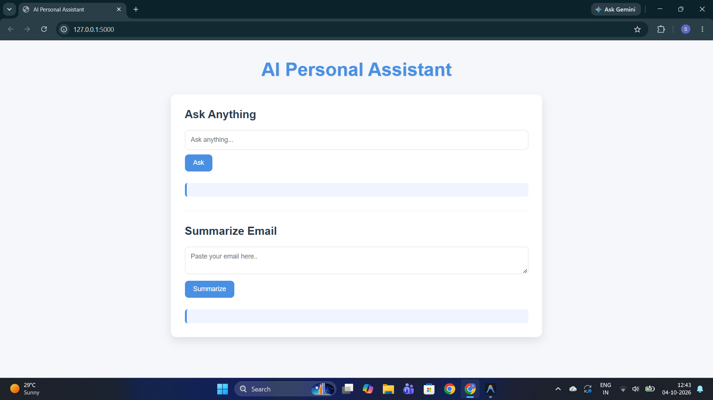
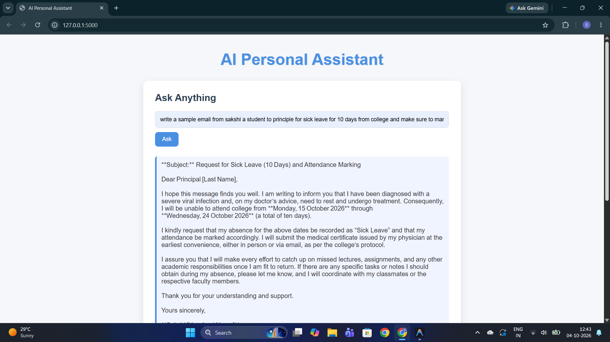
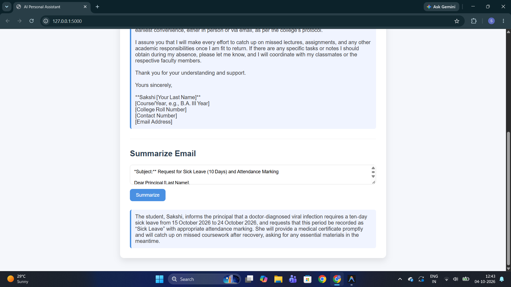

# 🤖 AI Personal Assistant — Flask


---

## 📌 Project Overview

**AI Personal Assistant** is a full-stack web application that brings the power of large language models directly into your browser. Built with **Python & Flask** on the backend and a clean **HTML/CSS** frontend, it helps users automate everyday tasks — from drafting professional emails to summarizing long text — all through a simple, intuitive interface.

> No complex setup. Just ask, and the AI handles the rest.

---

## 🚀 Key Features

- 💬 **Ask Anything** — Get instant, context-aware answers to any question using OpenAI's language models
- 📧 **Email Summarizer** — Paste any email and receive a concise 2–3 sentence summary in seconds
- ⚡ **Real-time AI Responses** — Streamed text generation with zero page reloads (AJAX-powered)
- 🎨 **Clean, Responsive UI** — Minimal and distraction-free interface that works across devices
- 🔐 **Secure API Key Handling** — API keys stored safely in `.env`, never exposed to the frontend

---

## 📸 Screenshots

### Main Interface


### Ask Anything — AI Response


### Summarize Email — Output


---

## 🛠️ Tech Stack

| Layer | Technology |
|---|---|
| **Backend** | Python 3.10+, Flask |
| **Frontend** | HTML5, CSS3 |
| **AI / LLM** | OpenAI API (`gpt-4o`) |
| **Config** | python-dotenv |
| **HTTP Client** | OpenAI Python SDK |

---

## ⚙️ How to Run Locally

### 1. Clone the Repository

```bash
git clone https://github.com/sakshimadkar/AI-Personal-Assistant-Flask.git
cd AI-Personal-Assistant-Flask
```

### 2. Create & Activate a Virtual Environment

```bash
# Create virtual environment
python -m venv venv

# Activate on Windows
venv\Scripts\activate

# Activate on Mac/Linux
source venv/bin/activate
```

### 3. Install Dependencies

```bash
pip install -r requirements.txt
```

### 4. Set Up Environment Variables

Create a `.env` file in the project root:

```bash
OPENAI_API_KEY=your_openai_api_key_here
```

> 🔑 Get your API key from [OpenAI Platform](https://platform.openai.com/api-keys) or use a Groq-compatible key.

### 5. Run the Application

```bash
python main.py
```

Open your browser and navigate to: **http://127.0.0.1:5000**

---

## 📁 Project Structure

```
AI-Personal-Assistant-Flask/
│
├── main.py               # Flask app — routes & API logic
├── templates/
│   └── index.html        # Frontend HTML template
├── static/
│   └── style.css         # Stylesheet
├── screenshots/          # App preview images
├── .env                  # API keys (not committed)
├── .gitignore
└── README.md
```

---

## 👩‍💻 Author

**Sakshi Madkar**
[](https://github.com/sakshimadkar)

---

> ⭐ If you found this project useful, consider giving it a star!